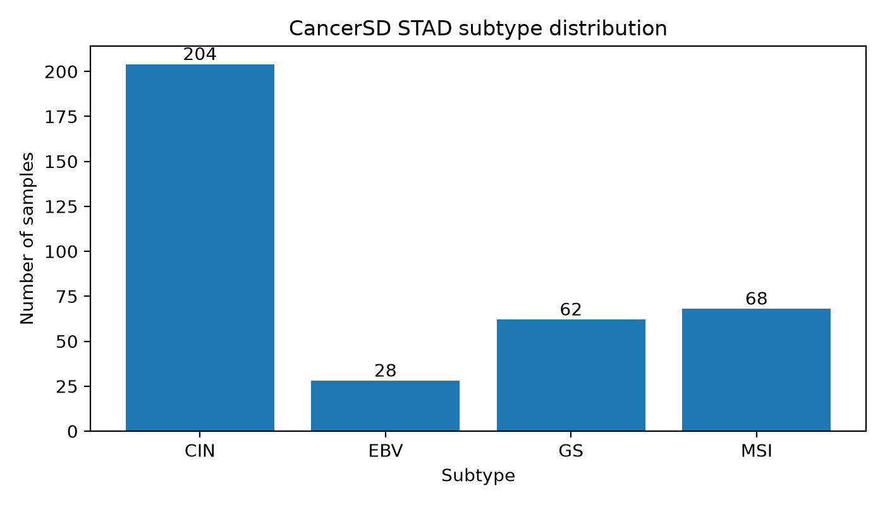

# CancerSD STAD Data Preprocessing Report

Generated at: `2026-06-24T15:17:47`

## 1. Dataset objective

This report documents the preprocessing of the CancerSD STAD mRNA dataset for the project:

**A comparative study of feature selection method for cancer classification using gene expression data**

The goal of this preprocessing step is to convert the raw STAD mRNA expression data into a clean machine learning format suitable for feature selection and cancer subtype classification experiments.

## 2. Raw input data

The raw CancerSD STAD files used in this step are:

- `mRNA.zip`: mRNA expression data.
- `patient_diagnose.csv`: sample-level diagnosis and subtype information.

The original mRNA matrix is organized as **genes × samples**, so it was transposed into **samples × genes**.

| Item | Value |
|---|---:|
| Raw mRNA shape after transpose | [362, 4089] |
| Raw diagnosis shape after transpose | [415, 4] |
| Raw mRNA sample count | 362 |
| Diagnosis sample count | 415 |
| Raw gene feature count | 4089 |

## 3. Preprocessing procedure

The following preprocessing steps were applied:

1. Loaded `mRNA.zip` and extracted the mRNA expression table.
2. Transposed mRNA expression from genes × samples to samples × genes.
3. Loaded `patient_diagnose.csv`.
4. Transposed diagnosis information from aspects × samples to samples × metadata.
5. Used the `subtype` row as the classification label.
6. Standardized sample identifiers by converting them to strings and trimming spaces.
7. Converted all gene expression values to numeric values.
8. Checked missing values in the expression matrix.
9. Removed genes with no useful variation:
   - all-missing genes: 0
   - constant genes: 0
10. Matched expression samples with diagnosis labels.
11. Exported the cleaned dataset into a unified format.

Important note: no global standardization, train-test split, or feature selection was fitted in this preprocessing step. These operations must be fitted only on the training data inside the later machine learning pipeline to avoid data leakage.

## 4. Sample matching result

| Item | Value |
|---|---:|
| Expression samples | 362 |
| Diagnosis samples | 415 |
| Matched samples | 362 |
| Expression-only samples removed | 0 |
| Label-only samples removed | 53 |

The diagnosis file contains 415 samples, but only 362 samples have matching mRNA expression profiles. Therefore, 53 label-only samples were excluded from the final gene expression classification dataset.

## 5. Processed data summary

| Item | Value |
|---|---:|
| Final sample count | 362 |
| Final gene count | 4089 |
| Missing values before imputation | 0 |
| Removed all-missing genes | 0 |
| Removed constant genes | 0 |

## 6. Label mapping

| Label | Class ID |
|---|---:|
| CIN | 0 |
| EBV | 1 |
| GS | 2 |
| MSI | 3 |

## 7. Class distribution

| Class ID | Subtype | Samples | Percentage (%) |
| --- | --- | --- | --- |
| 0 | CIN | 204 | 56.35 |
| 1 | EBV | 28 | 7.73 |
| 2 | GS | 62 | 17.13 |
| 3 | MSI | 68 | 18.78 |

## 8. Output files

| File | Description | Size (MB) |
| --- | --- | --- |
| data/processed/cancersd_stad/X.csv | Processed mRNA expression matrix, samples x genes | 25.64 |
| data/processed/cancersd_stad/y.csv | Subtype labels | 0.0065 |
| data/processed/cancersd_stad/metadata.csv | Sample metadata | 0.0192 |
| data/processed/cancersd_stad/feature_names.csv | Retained gene names | 0.0243 |
| results/data_summaries/cancersd_stad_summary.json | Preprocessing summary | 0.0014 |

The processed files follow this format:

- `X.csv`: rows are samples, columns are mRNA gene expression features.
- `y.csv`: sample identifier, subtype label, and numeric label ID.
- `metadata.csv`: sample-level metadata including subtype, stage, race, and class ID.
- `feature_names.csv`: final list of retained gene names.

## 9. Validation

| Check | Status | Details |
| --- | --- | --- |
| Lightweight structural validation | PASS | No problems found |
| Deep validation | PASS | No problems found |

### Deep validation details

| Metric | Value |
|---|---:|
| Missing values in `X.csv` | 0 |
| All values finite | True |
| Constant genes after processing | 0 |

## 10. Conclusion

The CancerSD STAD dataset was successfully preprocessed. The final dataset contains **362 samples** and **4089 mRNA gene expression features** across **4 STAD molecular subtypes**. The processed dataset is ready for downstream feature selection and cancer subtype classification experiments.

