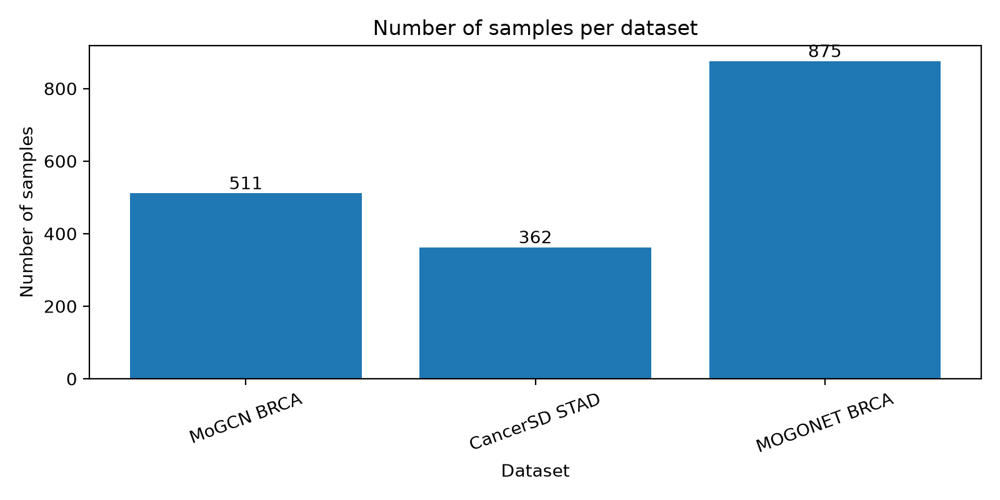
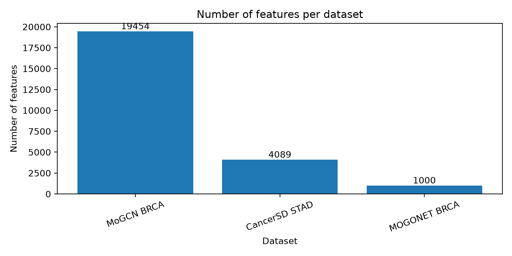

# Data Preprocessing Overview

Generated at: `2026-06-24T15:17:49`

## 1. Project context

This report summarizes the data preprocessing phase for the project:

**A comparative study of feature selection method for cancer classification using gene expression data**

The goal of this phase is to prepare clean and unified datasets for later experiments on feature selection and cancer subtype classification.

## 2. Dataset selection

Three datasets were prepared:

1. **MoGCN BRCA**: main BRCA gene expression dataset.
2. **CancerSD STAD**: main STAD mRNA gene expression dataset.
3. **MOGONET BRCA**: optional BRCA benchmark dataset.

MOGONET BRCA is treated separately because its omics-1 data is already preprocessed and feature-reduced to 1,000 features by the original dataset. Therefore, it is useful as an additional benchmark, but it should not be interpreted in the same way as the more raw gene expression datasets.

## 3. Why datasets are not merged

The datasets were not merged into one large table because they come from different studies, cancer types, preprocessing pipelines, subtype definitions, and feature spaces. Direct merging may introduce batch effects and unreliable comparisons.

Instead, each dataset is converted into the same processed format and evaluated independently using the same machine learning pipeline.

## 4. Common processed format

Each processed dataset follows this structure:

    data/processed/<dataset_name>/
    ├── X.csv
    ├── y.csv
    ├── metadata.csv
    └── feature_names.csv

Where:

- `X.csv`: samples × genes/features matrix.
- `y.csv`: sample IDs and class labels.
- `metadata.csv`: sample-level metadata.
- `feature_names.csv`: retained gene or feature names.

For MOGONET BRCA, the original train/test split is also preserved:

    X_train.csv
    X_test.csv
    y_train.csv
    y_test.csv

## 5. Dataset summary

| Dataset | Cancer type | Role | Samples | Features | Feature type | Classes | Missing values | Removed constant features |
| --- | --- | --- | --- | --- | --- | --- | --- | --- |
| MoGCN BRCA | BRCA | Main dataset | 511 | 19454 | genes | 4 | 0 | 126 |
| CancerSD STAD | STAD | Main dataset | 362 | 4089 | genes | 4 | 0 | 0 |
| MOGONET BRCA | BRCA | Optional benchmark | 875 | 1000 | preprocessed features | 5 | 0 | 0 |

## 6. Class distribution

| Dataset | Class label | Samples | Percentage (%) |
| --- | --- | --- | --- |
| MoGCN BRCA | Basal | 112 | 21.92 |
| MoGCN BRCA | Her2 | 53 | 10.37 |
| MoGCN BRCA | LumA | 248 | 48.53 |
| MoGCN BRCA | LumB | 98 | 19.18 |
| CancerSD STAD | CIN | 204 | 56.35 |
| CancerSD STAD | EBV | 28 | 7.73 |
| CancerSD STAD | GS | 62 | 17.13 |
| CancerSD STAD | MSI | 68 | 18.78 |
| MOGONET BRCA | Basal-like | 131 | 14.97 |
| MOGONET BRCA | HER2-enriched | 46 | 5.26 |
| MOGONET BRCA | Luminal A | 436 | 49.83 |
| MOGONET BRCA | Luminal B | 147 | 16.8 |
| MOGONET BRCA | Normal-like | 115 | 13.14 |

## 7. Data leakage prevention

To avoid data leakage, the preprocessing phase only performs structural cleaning:

- sample-label matching,
- numeric conversion,
- missing-value checking,
- removal of all-missing or constant features,
- conversion into a unified machine learning format.

The following operations are **not** fitted globally during preprocessing:

- standardization,
- normalization,
- train-test split for datasets without official split,
- feature selection,
- model training.

These steps will be fitted only on the training data inside the later machine learning pipeline.

## 8. Final status

All three datasets passed validation checks and are ready for downstream feature selection and classification experiments.

| Dataset | Status |
|---|---|
| MoGCN BRCA | PASS |
| CancerSD STAD | PASS |
| MOGONET BRCA | PASS |

