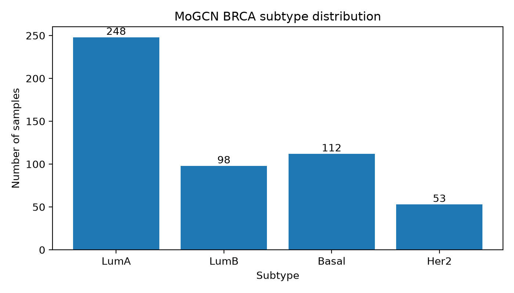

# MoGCN BRCA Data Preprocessing Report

Generated at: `2026-06-24T14:34:56`

## 1. Dataset objective

This report documents the preprocessing of the MoGCN BRCA gene expression dataset for the project:

**A comparative study of feature selection method for cancer classification using gene expression data**

The goal of this preprocessing step is to convert the raw BRCA gene expression data into a clean and unified machine learning format suitable for later feature selection and subtype classification experiments.

## 2. Raw input data

The raw dataset contains:

| Item | Value |
|---|---:|
| Raw expression table shape | [511, 19581] |
| Raw label table shape | [511, 3] |
| Raw sample count | 511 |
| Raw gene expression feature count | 19580 |
| Label sample count | 511 |

The expression table has one sample identifier column and 19580 gene expression columns.

## 3. Preprocessing procedure

The following preprocessing steps were applied:

1. Loaded `fpkm_data.csv` as the gene expression matrix.
2. Loaded `sample_classes.csv` as the subtype label file.
3. Standardized sample identifiers by converting them to strings and removing leading/trailing spaces.
4. Verified that sample identifiers are non-empty and non-duplicated.
5. Converted all gene expression values to numeric values.
6. Checked missing values in the expression matrix.
7. Removed genes with no useful variation:
   - all-missing genes: 0
   - constant genes: 126
8. Matched expression samples with label samples.
9. Exported the cleaned dataset into a unified format.

Important note: no global standardization, train-test split, or feature selection was fitted in this preprocessing step. These operations must be fitted only on the training data inside the later machine learning pipeline to avoid data leakage.

## 4. Processed data summary

| Item | Value |
|---|---:|
| Matched sample count | 511 |
| Expression-only samples removed | 0 |
| Label-only samples removed | 0 |
| Final sample count | 511 |
| Final gene count | 19454 |
| Missing values before imputation | 0 |
| Removed constant genes | 126 |

## 5. Class distribution

| Class ID | Subtype | Samples | Percentage (%) |
| --- | --- | --- | --- |
| 0 | LumA | 248 | 48.53 |
| 1 | LumB | 98 | 19.18 |
| 2 | Basal | 112 | 21.92 |
| 3 | Her2 | 53 | 10.37 |

## 6. Output files

| File | Description | Size (MB) |
| --- | --- | --- |
| data/processed/mogcn_brca/X.csv | Processed expression matrix, samples x genes | 161.24 |
| data/processed/mogcn_brca/y.csv | Subtype labels | 0.0074 |
| data/processed/mogcn_brca/metadata.csv | Sample metadata | 0.0153 |
| data/processed/mogcn_brca/feature_names.csv | Retained gene names | 0.1212 |
| results/data_summaries/mogcn_brca_summary.json | Preprocessing summary | 0.001 |

The processed files follow this format:

- `X.csv`: rows are samples, columns are selected gene expression features after structural cleaning.
- `y.csv`: sample identifier, subtype label, and numeric label ID.
- `metadata.csv`: sample-level information for downstream analysis.
- `feature_names.csv`: final list of retained gene names.

## 7. Validation

| Check | Status | Details |
| --- | --- | --- |
| Lightweight structural validation | PASS | No problems found |
| Deep validation | PASS | No problems found |

### Deep validation details

| Metric | Value |
|---|---|
| Missing values in `X.csv` | 0 |
| All values finite | True |
| Constant genes after processing | 0 |

## 8. Conclusion

The MoGCN BRCA dataset was successfully preprocessed. The final dataset contains **511 samples** and **19454 gene expression features** across **4 BRCA molecular subtypes**. The processed dataset is ready for downstream experiments on feature selection and cancer subtype classification.

