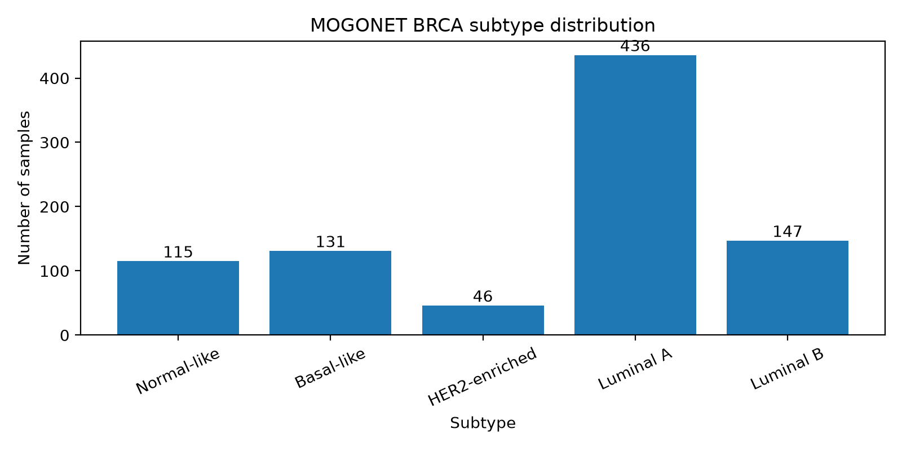

# MOGONET BRCA Data Preprocessing Report

Generated at: `2026-06-24T15:17:48`

## 1. Dataset objective

This report documents the preprocessing of the MOGONET BRCA omics-1 dataset for the project:

**A comparative study of feature selection method for cancer classification using gene expression data**

This dataset is used as an **optional benchmark dataset**. Unlike MoGCN BRCA and CancerSD STAD, the MOGONET BRCA omics-1 data is already preprocessed and feature-reduced by the original MOGONET dataset. Therefore, it should not be treated as raw gene expression data.

## 2. Raw input data

The raw files used in this step are:

- `1_tr.csv`: training omics-1 feature matrix.
- `1_te.csv`: testing omics-1 feature matrix.
- `1_featname.csv`: feature names.
- `labels_tr.csv`: training labels.
- `labels_te.csv`: testing labels.

| Item | Value |
|---|---:|
| Raw train expression shape | [612, 1000] |
| Raw test expression shape | [263, 1000] |
| Raw feature count | 1000 |
| Train sample count | 612 |
| Test sample count | 263 |
| Final sample count | 875 |

## 3. Preprocessing procedure

The following preprocessing steps were applied:

1. Loaded `1_tr.csv` and `1_te.csv` as the omics-1 feature matrices.
2. Loaded `1_featname.csv` and assigned feature names to the matrices.
3. Loaded `labels_tr.csv` and `labels_te.csv`.
4. Mapped numeric label IDs to BRCA subtype names.
5. Generated synthetic sample IDs because original sample IDs are not provided in the CSV files.
6. Preserved the original MOGONET train/test split.
7. Concatenated train and test data into a unified `X.csv` and `y.csv`.
8. Checked missing values.
9. Removed all-missing or constant features if any.
10. Exported both combined files and split-specific files.

Important note: no additional global scaling or feature selection was fitted in this preprocessing step.

## 4. Dataset caveat

MOGONET BRCA omics-1 is already preprocessed and feature-reduced by the original MOGONET dataset. It is used as an optional benchmark dataset, not as raw gene expression.

Original sample IDs are not included in the MOGONET CSV files. Synthetic sample IDs were generated while preserving the original train/test split.

This means MOGONET BRCA can be used for comparison, but the interpretation should be separated from the two more raw gene expression datasets.

## 5. Processed data summary

| Item | Value |
|---|---:|
| Final sample count | 875 |
| Final feature count | 1000 |
| Train sample count | 612 |
| Test sample count | 263 |
| Missing values before imputation | 0 |
| Removed all-missing features | 0 |
| Removed constant features | 0 |

## 6. Label mapping

| Class ID | Label |
|---|---|
| 0 | Normal-like |
| 1 | Basal-like |
| 2 | HER2-enriched |
| 3 | Luminal A |
| 4 | Luminal B |

## 7. Class distribution

| Class ID | Subtype | Samples | Percentage (%) |
| --- | --- | --- | --- |
| 0 | Normal-like | 115 | 13.14 |
| 1 | Basal-like | 131 | 14.97 |
| 2 | HER2-enriched | 46 | 5.26 |
| 3 | Luminal A | 436 | 49.83 |
| 4 | Luminal B | 147 | 16.8 |

## 8. Train/test class distribution

| Class ID | Subtype | Split | Samples |
| --- | --- | --- | --- |
| 0 | Normal-like | test | 35 |
| 0 | Normal-like | train | 80 |
| 1 | Basal-like | test | 39 |
| 1 | Basal-like | train | 92 |
| 2 | HER2-enriched | test | 14 |
| 2 | HER2-enriched | train | 32 |
| 3 | Luminal A | test | 131 |
| 3 | Luminal A | train | 305 |
| 4 | Luminal B | test | 44 |
| 4 | Luminal B | train | 103 |

## 9. Output files

| File | Description | Size (MB) |
| --- | --- | --- |
| data/processed/mogonet_brca_optional/X.csv | Combined preprocessed feature matrix, samples x features | 15.64 |
| data/processed/mogonet_brca_optional/y.csv | Combined subtype labels | 0.0281 |
| data/processed/mogonet_brca_optional/metadata.csv | Sample metadata with source split | 0.0554 |
| data/processed/mogonet_brca_optional/feature_names.csv | Retained feature names | 0.0272 |
| data/processed/mogonet_brca_optional/X_train.csv | Original MOGONET training feature matrix | 10.94 |
| data/processed/mogonet_brca_optional/X_test.csv | Original MOGONET testing feature matrix | 4.71 |
| data/processed/mogonet_brca_optional/y_train.csv | Original MOGONET training labels | 0.0196 |
| data/processed/mogonet_brca_optional/y_test.csv | Original MOGONET testing labels | 0.0085 |
| results/data_summaries/mogonet_brca_summary.json | Preprocessing summary | 0.0019 |

The processed files follow this format:

- `X.csv`: combined samples × features matrix.
- `y.csv`: combined labels.
- `metadata.csv`: sample-level metadata including source split.
- `feature_names.csv`: retained feature names.
- `X_train.csv`, `y_train.csv`: preserved original training split.
- `X_test.csv`, `y_test.csv`: preserved original testing split.

## 10. Validation

| Check | Status | Details |
| --- | --- | --- |
| Lightweight structural validation | PASS | No problems found |
| Deep validation | PASS | No problems found |

### Deep validation details

| Metric | Value |
|---|---:|
| Missing values in `X.csv` | 0 |
| All values finite | True |
| Constant features after processing | 0 |

## 11. Conclusion

The MOGONET BRCA omics-1 dataset was successfully preprocessed. The final dataset contains **875 samples** and **1000 preprocessed features** across **5 BRCA molecular subtypes**. Since this dataset is already feature-reduced, it should be used as an optional benchmark rather than as the main raw gene expression dataset.

