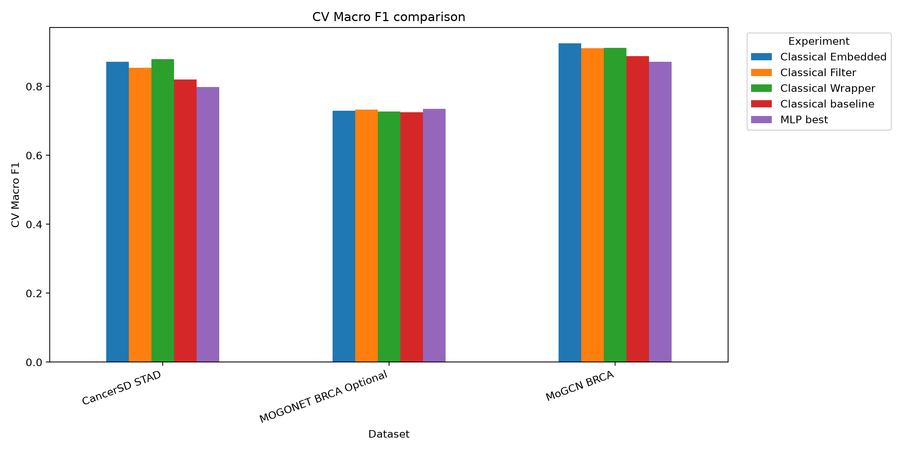
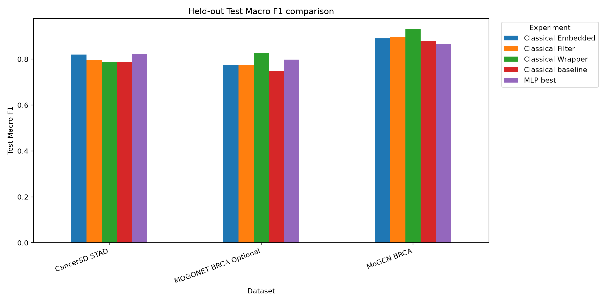
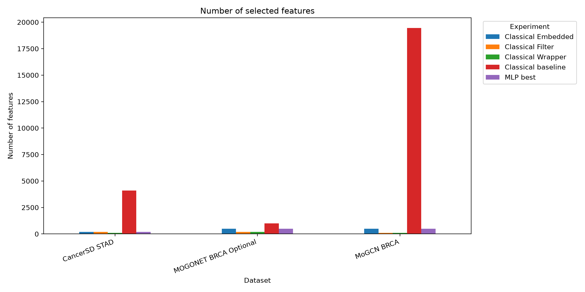

# Final Experiment Report

Generated at: `2026-06-25T09:37:35`

## 1. Purpose

This report summarizes the final experimental comparison for the project **A comparative study of feature selection method for cancer classification using gene expression data**.

It combines the no-feature-selection baseline, filter feature selection, wrapper RFE, embedded feature selection, and the additional MLP Neural Network classifier.

## 2. Experimental setting

All configurations were evaluated using 5-fold stratified cross-validation on `train_val`. The held-out test set was used only once for final evaluation.

The main model-selection metric is **CV Macro F1**, because the datasets are multiclass and class distributions are imbalanced.

Feature selection was always fitted inside the training part of each split to avoid data leakage.

## 3. Final comparison table

| Dataset | Experiment | FS Family | Selector | k | Model | Original Features | Selected Features | Reduction (%) | CV Accuracy | CV Macro F1 | CV Macro F1 Std | Test Accuracy | Test Macro F1 |
| --- | --- | --- | --- | --- | --- | --- | --- | --- | --- | --- | --- | --- | --- |
| CancerSD STAD | Classical Wrapper | Wrapper | RFE Logistic | 100 | Logistic Regression | 4089 | 100 | 97.5544 | 0.8731 | 0.8787 | 0.0324 | 0.8182 | 0.7868 |
| CancerSD STAD | Classical Embedded | Embedded | L1 Logistic | 200 | Logistic Regression | 4089 | 200 | 95.1088 | 0.8698 | 0.8716 | 0.0617 | 0.8182 | 0.82 |
| CancerSD STAD | Classical Filter | Filter | ANOVA F-test | 200 | Logistic Regression | 4089 | 200 | 95.1088 | 0.8534 | 0.8545 | 0.0411 | 0.8182 | 0.7947 |
| CancerSD STAD | Classical baseline | Baseline | No FS | 4089 | Random Forest | 4089 | 4089 | 0.0 | 0.8242 | 0.8197 | 0.0211 | 0.8182 | 0.7874 |
| CancerSD STAD | MLP best | Embedded | L1 Logistic | 200 | MLP Neural Network | 4089 | 200 | 95.1088 | 0.8078 | 0.7985 | 0.033 | 0.8364 | 0.8224 |
| MoGCN BRCA | Classical Embedded | Embedded | Extra Trees Importance | 500 | Logistic Regression | 19454 | 500 | 97.4298 | 0.9309 | 0.925 | 0.0283 | 0.9091 | 0.8907 |
| MoGCN BRCA | Classical Wrapper | Wrapper | RFE Linear SVM | 100 | Random Forest | 19454 | 100 | 99.486 | 0.9263 | 0.9119 | 0.0241 | 0.9351 | 0.9311 |
| MoGCN BRCA | Classical Filter | Filter | Mutual Information | 100 | Logistic Regression | 19454 | 100 | 99.486 | 0.924 | 0.9113 | 0.0568 | 0.9091 | 0.8952 |
| MoGCN BRCA | Classical baseline | Baseline | No FS | 19454 | Random Forest | 19454 | 19454 | 0.0 | 0.9055 | 0.8878 | 0.0348 | 0.9091 | 0.8784 |
| MoGCN BRCA | MLP best | Embedded | Extra Trees Importance | 500 | MLP Neural Network | 19454 | 500 | 97.4298 | 0.8894 | 0.8717 | 0.0523 | 0.8831 | 0.8651 |
| MOGONET BRCA Optional | MLP best | Embedded | Extra Trees Importance | 500 | MLP Neural Network | 1000 | 500 | 50.0 | 0.7663 | 0.7346 | 0.0464 | 0.8327 | 0.7979 |
| MOGONET BRCA Optional | Classical Filter | Filter | Variance Top-K | 200 | Random Forest | 1000 | 200 | 80.0 | 0.7664 | 0.7329 | 0.0349 | 0.8251 | 0.7733 |
| MOGONET BRCA Optional | Classical Embedded | Embedded | Extra Trees Importance | 500 | Random Forest | 1000 | 500 | 50.0 | 0.7582 | 0.7295 | 0.0223 | 0.8175 | 0.7743 |
| MOGONET BRCA Optional | Classical Wrapper | Wrapper | RFE Logistic | 200 | GaussianNB | 1000 | 200 | 80.0 | 0.7354 | 0.7275 | 0.0378 | 0.8327 | 0.8269 |
| MOGONET BRCA Optional | Classical baseline | Baseline | No FS | 1000 | Random Forest | 1000 | 1000 | 0.0 | 0.7566 | 0.7255 | 0.017 | 0.8099 | 0.7491 |

## 4. Best overall configuration by CV Macro F1

| Dataset | Experiment | FS Family | Selector | k | Model | Original Features | Selected Features | Reduction (%) | CV Accuracy | CV Macro F1 | CV Macro F1 Std | Test Accuracy | Test Macro F1 |
| --- | --- | --- | --- | --- | --- | --- | --- | --- | --- | --- | --- | --- | --- |
| CancerSD STAD | Classical Wrapper | Wrapper | RFE Logistic | 100 | Logistic Regression | 4089 | 100 | 97.5544 | 0.8731 | 0.8787 | 0.0324 | 0.8182 | 0.7868 |
| MoGCN BRCA | Classical Embedded | Embedded | Extra Trees Importance | 500 | Logistic Regression | 19454 | 500 | 97.4298 | 0.9309 | 0.925 | 0.0283 | 0.9091 | 0.8907 |
| MOGONET BRCA Optional | MLP best | Embedded | Extra Trees Importance | 500 | MLP Neural Network | 1000 | 500 | 50.0 | 0.7663 | 0.7346 | 0.0464 | 0.8327 | 0.7979 |

## 5. Best descriptive test result

This table is descriptive only. Test results should not be used for model selection.

| Dataset | Experiment | FS Family | Selector | k | Model | Original Features | Selected Features | Reduction (%) | CV Accuracy | CV Macro F1 | CV Macro F1 Std | Test Accuracy | Test Macro F1 |
| --- | --- | --- | --- | --- | --- | --- | --- | --- | --- | --- | --- | --- | --- |
| CancerSD STAD | MLP best | Embedded | L1 Logistic | 200 | MLP Neural Network | 4089 | 200 | 95.1088 | 0.8078 | 0.7985 | 0.033 | 0.8364 | 0.8224 |
| MoGCN BRCA | Classical Wrapper | Wrapper | RFE Linear SVM | 100 | Random Forest | 19454 | 100 | 99.486 | 0.9263 | 0.9119 | 0.0241 | 0.9351 | 0.9311 |
| MOGONET BRCA Optional | Classical Wrapper | Wrapper | RFE Logistic | 200 | GaussianNB | 1000 | 200 | 80.0 | 0.7354 | 0.7275 | 0.0378 | 0.8327 | 0.8269 |

## 6. MLP versus best classical configuration

| Dataset | Best Classical Experiment | Best Classical Selector | Best Classical Model | Classical CV Macro F1 | Classical Test Macro F1 | MLP Selector | MLP CV Macro F1 | MLP Test Macro F1 | Δ MLP-Classical CV | Δ MLP-Classical Test |
| --- | --- | --- | --- | --- | --- | --- | --- | --- | --- | --- |
| CancerSD STAD | Classical Wrapper | RFE Logistic | Logistic Regression | 0.8787 | 0.7868 | L1 Logistic | 0.7985 | 0.8224 | -0.0803 | 0.0355 |
| MoGCN BRCA | Classical Embedded | Extra Trees Importance | Logistic Regression | 0.925 | 0.8907 | Extra Trees Importance | 0.8717 | 0.8651 | -0.0533 | -0.0256 |
| MOGONET BRCA Optional | Classical Filter | Variance Top-K | Random Forest | 0.7329 | 0.7733 | Extra Trees Importance | 0.7346 | 0.7979 | 0.0017 | 0.0245 |

## 7. Figures

## 8. Main observations

- **CancerSD STAD**: best configuration by CV Macro F1 is Classical Wrapper / RFE Logistic / k=100 / Logistic Regression, with CV Macro F1 = 0.8787 and test Macro F1 = 0.7868.
- **MoGCN BRCA**: best configuration by CV Macro F1 is Classical Embedded / Extra Trees Importance / k=500 / Logistic Regression, with CV Macro F1 = 0.9250 and test Macro F1 = 0.8907.
- **MOGONET BRCA Optional**: best configuration by CV Macro F1 is MLP best / Extra Trees Importance / k=500 / MLP Neural Network, with CV Macro F1 = 0.7346 and test Macro F1 = 0.7979.
- **CancerSD STAD**: the best classical configuration remained stronger than MLP by CV Macro F1 (Δ CV Macro F1 = -0.0803).
- **MoGCN BRCA**: the best classical configuration remained stronger than MLP by CV Macro F1 (Δ CV Macro F1 = -0.0533).
- **MOGONET BRCA Optional**: MLP was competitive or better than the best classical configuration by CV Macro F1 (Δ CV Macro F1 = 0.0017).

Overall, the results show that feature selection can greatly reduce the number of genes/features while preserving or improving classification performance. The MLP classifier adds a neural-network baseline, but it does not consistently outperform the best classical machine learning configurations on these small high-dimensional datasets.

## 9. Generated files

- `reports/final_experiments/final_experiment_report.md`
- `reports/final_experiments/final_comparison_table.csv`
- `reports/final_experiments/best_overall_by_cv.csv`
- `reports/final_experiments/best_descriptive_test.csv`
- `reports/final_experiments/mlp_vs_best_classical.csv`
- `reports/final_experiments/figures/*.png`
